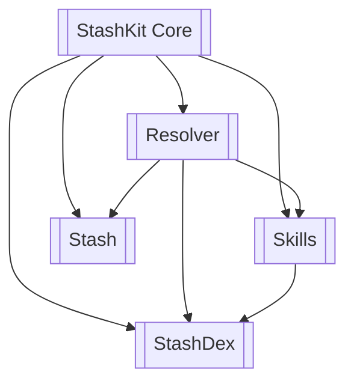
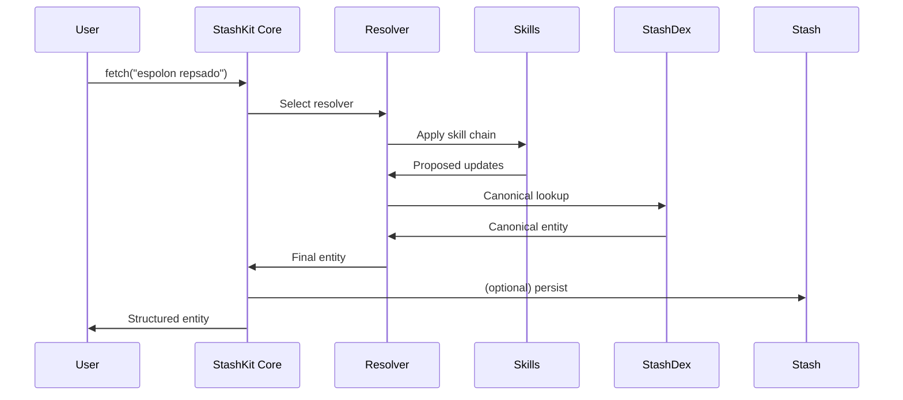
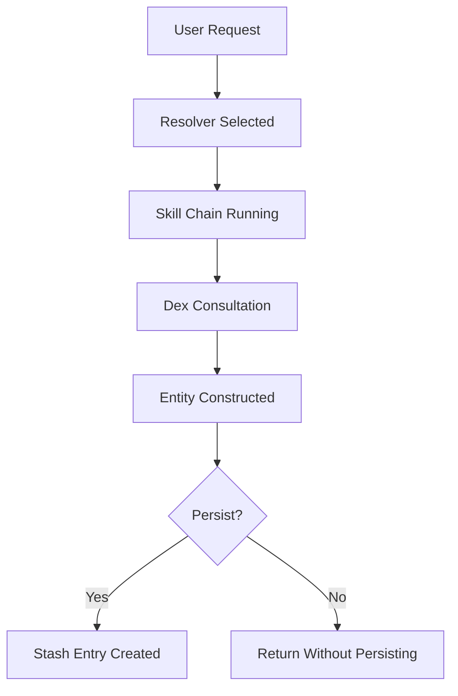

# 📘 StashKit & Barback

**StashKit** is a modular framework for turning messy, human-provided input into clean, structured, domain-aware entities. It does this through a coordinated ecosystem of:

- **Resolvers** — interpret user intent and orchestrate Skills  
- **Skills** — atomic processors (OCR, barcode, AI vision, text normalization, user prompts, etc.)  
- **StashDexes** — domain ontologies, alias maps, canonical entities, inference engines  
- **Stashes** — persistent stores for resolved entities  
- **BoosterPacks** — pluggable modules that install Dexes, Resolvers, Skills, and utilities

**Barback** is an example application built *on top of* StashKit.  
It applies the framework to spirits and cocktails, providing the ability to understand bottles, labels, UPCs, categories, and cocktail recipes.

Together, StashKit and Barback demonstrate a reusable pattern for building intelligent ingestion engines in any domain.

---

# 🧭 What’s in This Repository

This repository includes:

### **✔ StashKit Framework Architecture (MetaDex v1.3)**  
A canonical, machine-readable JSON file describing:
- Systems and subsystems  
- Entity definitions  
- Relationships  
- Rules  
- Public APIs  

Generated from YAML under `/source_yaml/` using the MetaDex compiler.

### **✔ User-Facing Documentation (`/docs`)**  
Seven developer-friendly documents:

- `01_Overview.md` — what StashKit *is*  
- `02_Getting_Started.md` — your first `fetch()`  
- `03_Concepts.md` — the conceptual model  
- `04_TinyBar_Hello_World.md` — BoosterPack example  
- `05_Developer_Quickstart.md` — writing Skills + Resolvers  
- `06_Workflow_Examples.md` — resolution flows  
- `07_For_ML_use.md` — instructions for LLM use  

### **✔ MetaDex Compiler (v2)**  
Located under `/compiler/compiler.py`.  
It validates YAML, enforces schema rules, and generates `metadex.json`.

### **✔ TinyBar BoosterPack**  
A spirits/cocktail BoosterPack demonstrating a real domain ontology and resolver.

### **✔ Barback Application (optional)**  
An example application showing StashKit in action.

---

# 🧩 StashKit Architecture

Below are diagrams showing how StashKit’s components interact.

---

## 🧠 **System-Level Architecture**



---

## 🔁 **Resolution Pipeline**



---

## 📦 **BoosterPack Installation Flow**

```mermaid
flowchart LR
    Install[install_booster("tinybar")]
    Dex[BoozeDex Loaded]
    Skills[Skills Registered]
    Resolver[BottleResolver Registered]

    Install --> Dex
    Install --> Skills
    Install --> Resolver
```

---

## 🗃 **Entity Lifecycle**



---

# 🚀 Getting Started

```python
from stashkit import fetch, install_booster

install_booster("tinybar")

item = fetch("espolon repsado")
print(item.brand)   # Espolón
print(item.type)    # Tequila Reposado
```

---

# 📦 Project Structure

```
.
├── compiler/             # MetaDex compiler v2
├── docs/                 # User-facing documentation
├── metadex/              # Generated metadex.json
├── source_yaml/          # YAML definitions (core, subsystems, terminology, rules)
├── stashkit/             # StashKit implementation (if included)
└── barback/              # Example application
```

---

# 🛠 MetaDex Compiler Usage

Generate canonical architecture:

```bash
python compiler/compiler.py --source source_yaml --output metadex/metadex.json
```

Minify it:

```bash
python compiler/compiler.py --source source_yaml --output metadex/metadex.json --minify
```

---

# 🧪 Custom Domain Development

To build a new domain:

1. Create a StashDex (ontology)  
2. Implement Skills  
3. Create a Resolver  
4. Package them into a BoosterPack  
5. Install it with `install_booster("mydomain")`  
6. Call `fetch()`  

---

# 🤖 Notes for LLM Integrations

LLMs should load `metadex.json` and use:

- `entities`  
- `relationships`  
- `rules`  
- `api.public_methods`  

Internal methods are private.

---

# 📝 License / Contributions

Add project licenses and contribution guidelines here.

