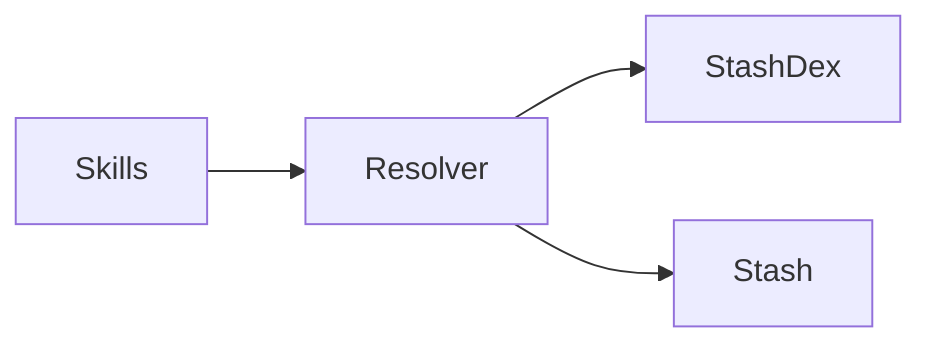

# StashKit Concepts (Deep Dive)

This document contains the conceptual foundation of StashKit: what each subsystem does, why it exists, and how the pieces interact.

---

# 🧠 Core Concepts

## **StashKit Core**
The orchestrator. It coordinates Skills, Resolvers, StashDexes, and Stashes.  
It exposes high-level convenience functions like `fetch()` and manages BoosterPack installation.

---

## **Skills**
Skills are atomic processors that:

- extract signals  
- normalize values  
- perform OCR  
- detect barcodes  
- call AI vision models  
- query APIs  
- ask users for clarification  

Skills return *proposals*—not decisions.

```python
{
  "brand": ("Espolón", confidence=0.78)
}
```

Resolvers merge these proposals.

---

## **Resolvers**
Resolvers are domain-aware orchestrators.

A resolver knows:

- which Skills to run  
- in what order  
- which fields must be present  
- how to merge conflicting proposals  
- which StashDex it relies on  
- when resolution is “good enough”  

```python
class BottleResolver:
    required_fields = ["brand", "type"]
    skill_sequence = [
        "ocr.label",
        "vision.product",
        "text.normalize",
        "alias.lookup",
    ]
```

---

## **StashDex**
A StashDex is a domain ontology and lexicon.

It contains:

- canonical entities  
- aliases  
- classification axes  
- inference rules  
- standardized vocabulary  

Resolvers consult Dexes to enrich entities.

---

## **Stash**
Persistent storage of *resolved entities*, not ontology.

Each entry records:

- an entity snapshot  
- the Dex version used  
- an optional user-specified metadata block  

This ensures stability across ontology updates.

---

## **BoosterPacks**
Installable domain bundles that include:

- a StashDex  
- one or more Resolvers  
- Skills  
- helper modules  

Example:

```
tinybar/
  BoozeDex.yml
  BottleResolver.py
  skills/
```

---

# 🧬 Putting It Together (Diagram)



---

Next up: **04_TinyBar_Hello_World**.
