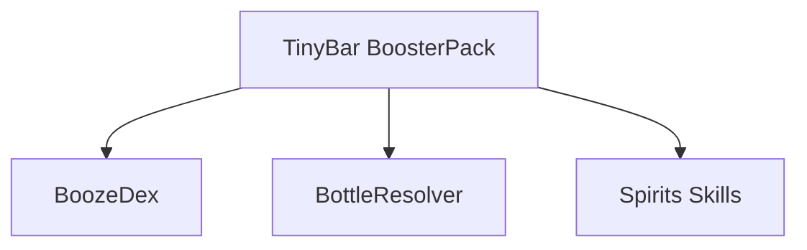

# TinyBar: A BoosterPack Example

TinyBar is a spirits-domain BoosterPack that includes:

- BoozeDex  
- BottleResolver  
- Spirits-related Skills  
- Cocktail-friendly enrichment logic  

---

# 🍸 Installing TinyBar

```python
from stashkit import install_booster
install_booster("tinybar")
```

---

# 🔍 Example: Recognizing a Bottle

```python
item = fetch("espolon repsado")
print(item.brand)   # Espolón
print(item.type)    # Tequila Reposado
```

Behind the scenes:

1. OCR Skill attempts to read “Repsado” from photo or text.  
2. Alias Skill corrects “Repsado” → “Reposado”.  
3. Vision Skill may detect bottle silhouette.  
4. BoozeDex enriches the entity:
   - agave type  
   - region  
   - classification  
   - legal category  

---

# 📦 What TinyBar Installs



---

# 🧯 Why BoosterPacks Matter

They let StashKit remain domain-agnostic while supporting arbitrarily rich domains.  
TinyBar demonstrates what high-quality domain modeling looks like.

Continue with **05_Developer_Quickstart** to build your own.
