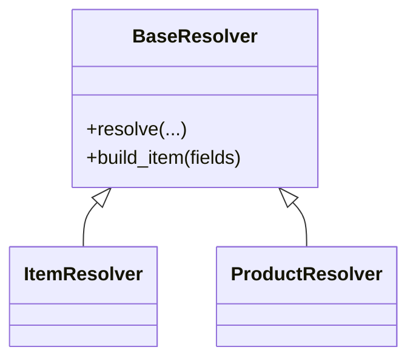
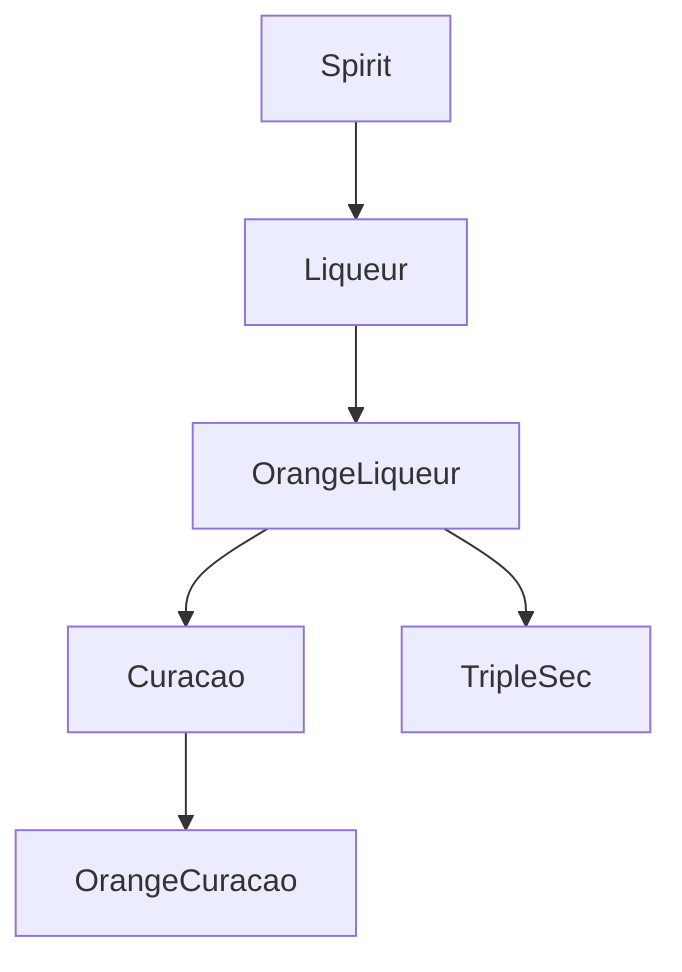

# StashKit: Framework Documentation

StashKit provides a domain-neutral ingestion and normalization framework using:

1. **Models** — `Item`, `Product`, and user-defined types
2. **Resolvers** — pipeline-style orchestrators
3. **StashSkills** — composable behaviors
4. **StashSource** — the knowledge provider abstraction
5. **DataStores** — pluggable persistence and caching
6. **Ontology Engine** — hierarchical semantic categories

---

## 1. Models

### `Item`

The most generic model:

- `id` (UUID)
- `name`
- `description` (optional)

No assumptions about UPC, brand, or commercial availability.

### `Product`

Extends `Item` with commercial product semantics:

- `upc: Optional[str]`
- `brand: Optional[str]`
- `manufacturer: Optional[str]`
- `volume_ml: Optional[int]`

Applications can subclass `Product` (e.g., `Bottle`, `GroceryItem`, etc.).

---

## 2. Resolver System

Resolvers implement a **template method** for ingestion:

```python
class BaseResolver(Generic[T], ABC):
    def resolve(self, *, upc: str | None, image_path: str | None,
                allow_manual: bool = True) -> T:
        ctx = ResolutionContext(upc=upc, image_path=image_path, fields={})
        # 1) UPCSkill
        # 2) DBLookupSkill
        # 3) AIVisionSkill
        # 4) Manual/KeyboardEntrySkill
        # 5) Other skills (brand, category, volume, dimensions, etc.)
        # 6) Build model
        ...
```

StashKit defines:

- `BaseResolver[T]`
- `ItemResolver[T]`
- `ProductResolver[T]`

Applications define **concrete resolvers** (e.g., `BottleResolver`) that are built by mixing in the right StashSkills.

A simple class relationship diagram:



---

## 3. StashSkills

Each StashSkill is a mixin that adds **one kind of enrichment**.

Key skills:

- **UPCSkill** – Normalize and record UPC input
- **DBLookupSkill** – Ask StashSource for metadata
- **AIVisionSkill** – Extract metadata from images
- **BrandSkill** – Normalize brand names via ontology/aliasing
- **CategorySkill** – Category inference using ontology
- **VolumeSkill** – ml/oz extraction
- **DimensionSkill** – Height/width/shape lookup
- **KeyboardEntrySkill** – Manual fallback

Internally, a skill typically:

1. Accepts a `ResolutionContext`
2. Calls `stash_source` (if needed)
3. Updates `context.fields`
4. Returns the updated context

---

## 4. StashSource (Knowledge Provider)

`StashSource` is the interface between resolvers/skills and all knowledge:

```python
class StashSource(ABC):
    @abstractmethod
    def lookup(self, feature: str, *,
               upc: str | None = None,
               name: str | None = None,
               hints: dict | None = None) -> dict | None:
        ...

    @abstractmethod
    def normalize_brand(self, brand: str) -> str | None:
        ...

    @abstractmethod
    def normalize_category(self, raw: str) -> list[str]:
        ...

    @abstractmethod
    def ontology(self) -> "Ontology":
        ...
```

Responsibilities:

- Providing metadata via `lookup(...)`
- Brand alias resolution
- Category normalization via ontology traversal
- Using DataStores to cache and persist data

---

## 5. DataStores

DataStores are pluggable storage backends used by `StashSource`.

A typical interface:

```python
class DataStore(ABC):
    @abstractmethod
    def get(self, key: str) -> dict | None: ...
    @abstractmethod
    def set(self, key: str, value: dict) -> None: ...
```

Implementations:

- `MemoryStore` — non-persistent cache
- `FilesystemStore` — JSON/YAML/CSV documents on disk
- `SQLiteStore` — structured relational storage
- `APIStore` — remote key/value backed by an HTTP API (scaffold)

---

## 6. Ontology Engine

The ontology provides a simple graph of categories and relationships.

Example (spirits-focused) graph:



The engine supports:

- Adding nodes and relationships
- Querying ancestors/descendants
- Resolving canonical category paths
- Handling aliases and synonyms

StashKit provides the ontology data structure; each application supplies its own data (e.g., Barback’s spirits ontology).
